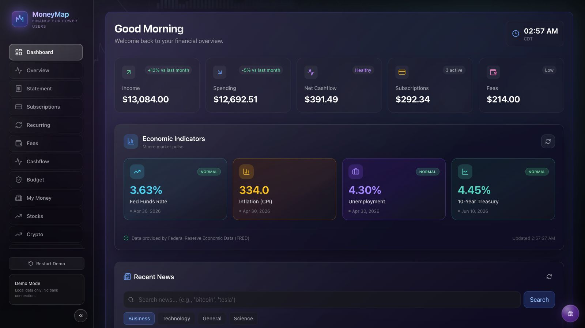

<div align="center">
  <picture>
    <source media="(prefers-color-scheme: dark)" srcset="docs/images/moneymap-logo-dark.svg">
    <source media="(prefers-color-scheme: light)" srcset="docs/images/moneymap-logo-light.svg">
    
  </picture>

  <h1>MoneyMap</h1>
  <p><strong>A local-first personal finance dashboard demo for exploring spending, cashflow, subscriptions, fees, budgets, stocks, crypto, news, and economic indicators without connecting a real bank account.</strong></p>
</div>

<div align="center">

[![License: MIT][license-shield]][license-url]
[![Next.js][next-shield]][next-url]
[![TypeScript][typescript-shield]][typescript-url]
[![React][react-shield]][react-url]

<p><strong>Live demo:</strong> <a href="https://money-map-eta-nine.vercel.app">money-map-eta-nine.vercel.app</a></p>

</div>

<div align="center">
  <a href="https://money-map-eta-nine.vercel.app">Live Demo</a> &middot;
  <a href="#quick-start">Quick Start</a> &middot;
  <a href="#usage">Usage</a> &middot;
  <a href="#configuration">Configuration</a> &middot;
  <a href="#deployment">Deployment</a> &middot;
  <a href="https://github.com/Nebulazer123/MoneyMap/issues/new?template=bug_report.md">Report Bug</a>
</div>

<br>



## Why MoneyMap?

Most finance demos either require sensitive account access or show static sample screens that do not behave like a real product. MoneyMap is for developers, reviewers, and product-minded builders who want to inspect a working personal finance dashboard with realistic demo data, route-level dashboards, API-backed widgets, and a responsive interface.

Use it when you want a polished finance UI to run locally, study, extend, or deploy as a portfolio-grade Next.js project. It is not a production banking app, a financial advisor, or a secure place to store real account data without additional hardening.

## Features

- Explore a full personal-finance dashboard with income, spending, net cashflow, budgets, subscriptions, recurring charges, fees, accounts, and category trends.
- Review realistic statement-style data, including suspicious charges, internal transfers, duplicate decisions, monthly summaries, and category drilldowns.
- Track stock and crypto watchlists through server-side API routes with caching, fallback states, and bounded request behavior.
- Try optional widgets for market news, FRED economic indicators, exchange rates, email validation, location utilities, charts, UUIDs, and generated helper data.
- Reset and replay local demo data without sharing real bank credentials or personal financial records.
- Inspect a responsive glass-style UI with sidebar navigation, dedicated stock and crypto pages, and a development-only debug menu.

## Quick Start

```bash
git clone https://github.com/Nebulazer123/MoneyMap.git
cd MoneyMap
npm install
npm run dev
```

Open [http://localhost:3000](http://localhost:3000), then choose **Try Demo**.

## Install

MoneyMap is a source-run Next.js app, not a published npm package.

| Requirement | Version |
|-------------|---------|
| Node.js | 20+ recommended |
| npm | 10+ recommended |

From the repository root:

```bash
npm install
```

The root scripts delegate to the nested Next.js app in `moneymap-v2/`.

## Usage

### Demo Flow

1. Start the app with `npm run dev`.
2. Open [http://localhost:3000](http://localhost:3000).
3. Click **Try Demo** to generate local sample data.
4. Move through Dashboard, Overview, Statement, Subscriptions, Fees, Cashflow, Budget, My Money, Stocks, Crypto, and Review.
5. Use **Restart Demo** when you want a fresh local dataset.

### Common Commands

```bash
npm run dev      # Start the local development server
npm run build    # Build the production app
npm run start    # Start the built Next.js app
npm run lint     # Run ESLint
```

The app folder also includes a targeted data-generation QA helper:

```bash
cd moneymap-v2
npm run qa:bucketC
```

## Configuration

MoneyMap runs without API keys. Missing keys fall back to demo data or graceful error states where the app supports it.

```bash
cp moneymap-v2/.env.example moneymap-v2/.env.local
```

| Variable | Purpose | Required |
|----------|---------|----------|
| `NEWS_API_KEY` | Live market and business news through the server-side news route | No |
| `ABSTRACT_EMAIL_API_KEY` | Email validation in the verification route | No |
| `FRED_API_KEY` | Federal Reserve economic indicator data | No |
| `NEXT_PUBLIC_SHOW_DEBUG` | Shows the development debug menu when set to `true` | No |

Provider keys should stay server-side. Do not rename secret values to `NEXT_PUBLIC_*` unless the value is intentionally safe to expose in the browser.

## How It Works

MoneyMap uses the Next.js App Router for pages and API routes, Zustand for local UI/data state, Recharts for dashboard visuals, and browser localStorage for generated demo data. Server-side routes wrap external services such as Yahoo Finance, CoinGecko, FRED, NewsAPI, Frankfurter, and Abstract so the client does not need direct provider keys.

```text
.
|-- moneymap-v2/
|   |-- src/app/             # Pages and API routes
|   |-- src/components/      # Dashboard, layout, onboarding, and UI components
|   |-- src/lib/             # Stores, data generation, selectors, cache, and finance logic
|   `-- scripts/             # Local QA helpers
|-- docs/images/             # README assets
|-- .github/                 # Issue and PR templates plus metadata draft
|-- package.json             # Root convenience scripts
|-- vercel.json              # Vercel build configuration for the nested app
`-- README.md
```

## Data And Privacy

MoneyMap does not connect to a bank account and does not persist financial data to a hosted database. Demo transactions are generated in the browser and saved to localStorage.

External market, news, exchange-rate, location, and utility requests are routed through server-side Next.js API routes. Do not send real personal financial data to these routes unless you have reviewed and extended the app for that use case.

## Deployment

The included `vercel.json` deploys the nested Next.js app:

```json
{
  "framework": "nextjs",
  "installCommand": "npm install && cd moneymap-v2 && npm install",
  "buildCommand": "cd moneymap-v2 && npm run build",
  "outputDirectory": "moneymap-v2/.next"
}
```

For Vercel, add optional environment variables in the project settings before deploying. Real `.env` files are intentionally ignored by git.

## Development

Before publishing changes, run:

```bash
npm run lint
npm run build
```

Keep API keys, local `.env` files, generated build output, `.vercel/` state, and dependency folders out of version control.

## Contributing

Contributions are welcome. Please read [CONTRIBUTING.md](CONTRIBUTING.md) before opening a pull request.

## Security

If you find a vulnerability, do not open a public issue. Follow the guidance in [SECURITY.md](SECURITY.md). Maintainers should add a monitored private security contact before inviting external vulnerability reports.

## License

MIT License. See [LICENSE](LICENSE) for details.

[license-shield]: https://img.shields.io/badge/License%3A-MIT-2ea44f.svg
[license-url]: https://github.com/Nebulazer123/MoneyMap/blob/main/LICENSE
[next-shield]: https://img.shields.io/badge/Next.js-16-black?logo=nextdotjs
[next-url]: https://nextjs.org/
[typescript-shield]: https://img.shields.io/badge/TypeScript-5-3178c6?logo=typescript&logoColor=white
[typescript-url]: https://www.typescriptlang.org/
[react-shield]: https://img.shields.io/badge/React-19-61dafb?logo=react&logoColor=111111
[react-url]: https://react.dev/
