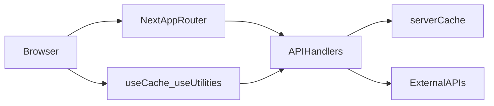

## A) Project Basics

### Active app & structure
- **Active app folder**: `moneymap-v2`
- **Entry & router type**:
  - Uses the **Next.js App Router** (presence of `src/app/layout.tsx`, `src/app/page.tsx`, and route segments under `src/app/...`).
- **High-level structure (within `moneymap-v2`)**:
  - `src/app`
    - `page.tsx`: root landing/dashboard entry.
    - `layout.tsx`: root app layout.
    - `dashboard/layout.tsx`, `dashboard/page.tsx`: main dashboard shell.
    - `dashboard/crypto/page.tsx`, `dashboard/stocks/page.tsx`: dedicated crypto and stocks dashboard pages.
    - `app/api/*/route.ts`: server-side API routes used by the dashboard (`charts`, `countries`, `crypto`, `economy`, `exchange`, `faker`, `location`, `logos`, `news`, `stocks`, `time`, `users`, `uuid`, `verification`, `weather`).
  - `src/components`
    - `dashboard/*`: dashboard feature components (Accounts, Budget, Cashflow, Crypto, CurrencyConverter, Dashboard, EconomicWidget, Fees, LocationWidget, MinigameModal, NewsFeed, Overview, Recurring, Review, StatementTab, Stocks, Subscriptions).
    - `layout/*`: `AppLayout`, `Sidebar` for shell/navigation.
    - `onboarding/*`: `UploadModal`.
    - `ui/*`: reusable UI primitives (`Badge`, `Button`, `GlassCard`, `InfoTooltip`, `Input`, `Ticker`).
  - `src/lib`
    - `cache/*`: client/server cache + rate limiting + hooks around `/api` (`CacheManager`, `serverCache`, `rateLimiter`, `useCache`, `useCrypto`, `useStocks`, `useUtilities`, `index.ts`).
    - `config.ts`, `constants/*`, `cryptoHelpers.ts`, `data/*`, `derived/*`, `generators/*`, `logic/*`, `math/*`, `selectors/*`, `store/*`, `types/*`, `utils.ts`: domain logic for transactions, lifestyle profiles, suspicious detection, metrics, math, derived views, and Zustand stores.
  - `scripts/*`: QA helpers (`qaBucketC.ts`, `qaFees.ts`).
  - `docs/*`: project specs and API documentation (including `APIS_INTEGRATED.md`).
  - Root app files: `next.config.ts`, `eslint.config.mjs`, `postcss.config.mjs`, `tsconfig.json`, `package.json`, `package-lock.json`, `public/*` assets.

### Next.js version & package manager
- **Next.js version**: `^16.0.7` (from both root `package.json` and `moneymap-v2/package.json`).
- **React version**: `^19.2.1` (`react`, `react-dom`).
- **Router type**: App Router (no `pages/` directory; all routes under `src/app`).
- **Package manager**: **npm**, indicated by `package-lock.json` at repo root and within `moneymap-v2/`.

### Scripts
- **Root `package.json`** (`package.json`):
  - `dev`: `cd moneymap-v2 && npm run dev`
  - `build`: `cd moneymap-v2 && npm run build`
  - `start`: `cd moneymap-v2 && npm run start`
  - `lint`: `cd moneymap-v2 && npm run lint`
- **App `moneymap-v2/package.json`**:
  - `dev`: `next dev`
  - `build`: `next build`
  - `start`: `next start`
  - `lint`: `eslint`
  - `qa:bucketC`: `npx tsx scripts/qaBucketC.ts`

### Node version
- **Node engines**: no explicit `engines` field in root or `moneymap-v2/package.json`.
- **Effective requirement**: whatever Node versions are supported by Next.js 16 (currently Node 18+). No enforced pinning within the repo.

---

## B) Dependency Inventory (from package.json)

### Core dependencies (moneymap-v2/package.json)

**Framework & core**
- `next@^16.0.7`: Next.js (App Router, server components, routing, API routes).
- `react@^19.2.1`: React core.
- `react-dom@^19.2.1`: React DOM renderer.

**UI / styling / icons**
- `lucide-react@^0.555.0`: icon set used in UI components.
- `clsx@^2.1.1`: conditional class string builder.
- `tailwind-merge@^3.4.0`: merges Tailwind class names to avoid conflicts.
- Tailwind/PostCSS dev chain:
  - `tailwindcss@^4`
  - `@tailwindcss/postcss@^4`
  - `postcss.config.mjs` configured to use `@tailwindcss/postcss`.

**State & data handling**
- `zustand@^5.0.9`: global state/store management for UI/data stores (`src/lib/store/*`).
- `@tanstack/react-virtual@^3.13.12`: virtualized lists (for large scrollable tables/lists in dashboard).

**Charts & visualization**
- `recharts@^3.5.1`: React charting library used in dashboard visualizations (e.g., overview, cashflow, stocks/crypto charts inside the app shell).

**External data / finance utilities**
- `yahoo-finance2@^3.10.2`: typed JS client for Yahoo Finance, used server-side from `src/app/api/crypto/route.ts` and `src/app/api/stocks/route.ts` for market data (quotes, charts, insights, movers, trending).

**Root-level dependencies (root `package.json`)**
- `next`, `react`, `react-dom`, `recharts` declared again with similar versions. These are effectively duplicative with `moneymap-v2` but only used to bootstrap scripts that delegate into `moneymap-v2`.

### Dev dependencies
- TypeScript & types: `typescript@^5`, `@types/node@^20`, `@types/react@^19`, `@types/react-dom@^19`.
- Linting: `eslint@^9`, `eslint-config-next@^16.0.7`, with `eslint.config.mjs` wiring Next core web vitals and TypeScript presets.
- Tailwind/PostCSS: `tailwindcss@^4`, `@tailwindcss/postcss@^4`.

### Heavy / duplicative / suspicious items
- **Duplicated framework deps**: `next`, `react`, `react-dom`, and `recharts` appear in both the root and `moneymap-v2` `package.json`. In practice the app runs from `moneymap-v2`, so the root dependencies are mostly redundant and can complicate dependency management.
- **Charting stack**:
  - `recharts` (client-side charts in the dashboard).
  - QuickChart external service (see section C) for image-based charts via `/api/charts` and `getChartImageUrl` in `useUtilities.ts`.
  - This is intentional (interactive charts vs exportable images), but it is a **dual charting system** that increases conceptual and API surface area.
- **No obviously unused NPM dependencies**:
  - `yahoo-finance2` is used by `src/app/api/crypto/route.ts` and `src/app/api/stocks/route.ts`.
  - `zustand`, `@tanstack/react-virtual`, `lucide-react`, `tailwind-merge`, `clsx` all have clear usages in `src/components` and `src/lib`.

---

## C) External Services + APIs

This section lists **every external integration**, where it’s used, caching/rate-limiting behavior, whether it appears active, and potential “runs out too fast” risks.

### High-level data flow

Client components generally call **local API routes** (`/api/...`) via hooks in `src/lib/cache/useUtilities.ts`, `useCrypto.ts`, `useStocks.ts`, and `useCache.ts`. Those routes then call external APIs, often via the shared server cache and rate limiter.

### 1. Yahoo Finance (Stocks & Crypto)
- **Service**: Yahoo Finance via `yahoo-finance2` NPM library.
- **Base**: no direct URL in code (library encapsulates it); imported as `import YahooFinance from 'yahoo-finance2';`.
- **Where used**:
  - `src/app/api/crypto/route.ts`: crypto prices, detail, search, and trending.
  - `src/app/api/stocks/route.ts`: stock quotes, charts, analyst data, earnings, movers, trending, and detailed stock views.
  - Downstream usage via:
    - `src/lib/cache/useCrypto.ts`: hooks that call `/api/crypto`.
    - `src/lib/cache/useStocks.ts`: hooks that call `/api/stocks`.
    - Components: `src/components/dashboard/Crypto.tsx`, `src/app/dashboard/crypto/page.tsx`, `src/components/dashboard/Stocks.tsx`, `src/app/dashboard/stocks/page.tsx` use those hooks or raw `/api/stocks`/`/api/crypto` fetches.
- **What for**:
  - Live quotes, detailed instrument data, charts for multiple time ranges, trending lists, analyst recommendations, earnings.
- **Caching**:
  - Server-side: `serverCache` from `src/lib/cache/serverCache.ts` plus `CACHE_TTL` from `CacheManager.ts`.
    - Crypto API: caches trending, search results, detail, and prices with TTLs like `CACHE_TTL.TRENDING` (15 minutes), `CACHE_TTL.SEARCH_RESULTS` (10 minutes), and `CACHE_TTL.LIVE_PRICES` (1 minute).
    - Stocks API: similar TTLs for trending/movers (15 minutes), quotes (1 minute), and charts (TTL based on range, e.g., `CACHE_TTL.CHART_1D`, `CACHE_TTL.CHART_1M`, `CACHE_TTL.CHART_1Y`).
  - Client-side: hooks like `useCrypto` and `useStocks` use `useCache` with TTLs tuned for live prices, charts, and trending.
- **Rate limiting / retries / timeouts**:
  - Rate limiting: both `crypto` and `stocks` API routes call `checkRateLimit(request, RATE_LIMITS.PER_MINUTE_30)` from `src/lib/cache/rateLimiter.ts`, enforcing ~30 requests/min per IP.
  - No explicit retry or timeout logic besides default Next.js/Node `fetch` behavior; errors are logged and sometimes fall back to stale cache.
- **Usage status**: **Active** and central to the dashboard experience (crypto/stocks pages and widgets).
- **Risk notes**:
  - Yahoo Finance is unofficial and rate limits are informal; the combination of server+client caching and per-IP rate limiting is a good mitigation.
  - Potential risk if multiple features (crypto, stocks, movers, charts, insights) are all hit in rapid succession (e.g., on initial dashboard load) without sufficient deduplication — `useCache` mitigates via `inFlightRequests` but raw fetches in pages/components may still fan out.

### 2. FRED – Federal Reserve Economic Data
- **Base**: `https://api.stlouisfed.org/fred`.
- **Where used**:
  - `src/app/api/economy/route.ts`.
  - Client hook: `useEconomicIndicators` in `src/lib/cache/useUtilities.ts` hits `/api/economy`.
  - UI: `src/components/dashboard/EconomicWidget.tsx` and related dashboard sections.
- **What for**:
  - Fetches macroeconomic indicators like Federal Funds Rate, CPI, unemployment rate, GDP, and 10-year Treasury yields.
- **Env vars**:
  - `FRED_API_KEY = process.env.FRED_API_KEY || 'demo';` (no `.env` in repo; expects runtime env or falls back to demo key).
- **Caching**:
  - Server-side: uses `serverCache` with an explicit TTL of 1 hour for both per-series queries and the multi-indicator dashboard payload.
  - Client-side: `useEconomicIndicators` caches results for 1 hour (`ttl: 60 * 60 * 1000`) in session storage plus stale-while-revalidate.
- **Rate limiting / retries**:
  - No explicit rate limiter on this route (no `checkRateLimit`); relies on caching and conservative TTL.
- **Usage status**: **Active** – called by `useEconomicIndicators` and rendered in `EconomicWidget`.
- **Risk notes**:
  - Uses `'demo'` key by default if env var is missing; this may have lower quotas or be unreliable.
  - No rate limiter; if multiple users or widgets poll series-specific endpoints with arbitrary `?series=` parameters, FRED usage could spike, though current code only hits a fixed set of series IDs.

### 3. Currency Exchange – Frankfurter (primary) & ExchangeRate-API (fallback)
- **Frankfurter base**: `https://api.frankfurter.app`.
- **ExchangeRate-API base**: `https://api.exchangerate-api.com/v4`.
- **Where used**:
  - `src/app/api/exchange/route.ts`.
  - Client hooks in `useUtilities.ts`: `useExchangeRates`, `useCurrencyConvert`, and the `POST /api/exchange` conversion helper.
  - UI: `src/components/dashboard/CurrencyConverter.tsx` and potentially other currency UI.
- **What for**:
  - Get latest and historical FX rates, convert between currencies, and provide popular currency subsets for UI.
- **Caching**:
  - Server-side: uses `serverCache` with `CACHE_TTL.EXCHANGE_RATES` (6 hours) for both primary and fallback responses.
  - Client-side: `useExchangeRates` and `useCurrencyConvert` use `useCache` with TTL = `CACHE_TTL.EXCHANGE_RATES` and local/session storage respectively.
- **Rate limiting / retries**:
  - No per-IP rate limiter on `/api/exchange`.
  - Basic two-step fallback: try Frankfurter, then ExchangeRate-API, then stale cache.
- **Usage status**: **Active** via `CurrencyConverter` and exchange-rate UI.
- **Risk notes**:
  - ExchangeRate-API free tier has a **1,500/month** cap; code only uses it as fallback, with long TTL (6 hours), which is good.
  - No explicit rate limiter; if Frankfurter is flaky and the app falls back to ExchangeRate-API frequently, quotas could be consumed.

### 4. ipapi.co – Geolocation / Location
- **Base**: `https://ipapi.co/json/` and `https://ipapi.co/{ip}/json/`.
- **Where used**:
  - `src/app/api/location/route.ts`.
  - Client hook: `useLocation` in `useUtilities.ts`, which calls `/api/location`.
  - UI: `src/components/dashboard/LocationWidget.tsx` calls `/api/location` directly and/or uses the hook, plus other widgets reading location/currency.
- **What for**:
  - Detects user IP, approximate city/region/country, timezone, and currency to personalize dashboard context.
- **Caching**:
  - Server-side: uses `serverCache` with `CACHE_TTL.LOCATION` (24 hours).
  - Client-side: `useLocation` uses `useCache` with TTL = `CACHE_TTL.TIMEZONE`/`LOCATION` and local storage (24 hours), stale-while-revalidate.
- **Rate limiting / retries**:
  - Route uses `checkRateLimit(request, RATE_LIMITS.PER_HOUR_50)` (~50 requests/hour/IP).
  - Errors fall back to cached data or a default US location/currency.
- **Usage status**: **Active** and integrated into the dashboard.
- **Risk notes**:
  - ipapi free tier allows ~1,000 requests/day; with both server and client caching + rate limiting, this is fairly safe, but heavy traffic or debug tooling that frequently calls `/api/location` could still approach limits.

### 5. NewsAPI.org – Financial News
- **Base**: `https://newsapi.org/v2`.
- **Where used**:
  - `src/app/api/news/route.ts`.
  - Client hooks: `useNews`, `useFinanceNews` in `useUtilities.ts` call `/api/news`.
  - UI: `src/components/dashboard/NewsFeed.tsx` and relevant dashboard sections.
- **What for**:
  - General and business news headlines and search results for financial context.
- **API key handling**:
  - Hard-coded key: `const NEWS_API_KEY = 'b04754f709c4439ea8e1a4a280c737cc';` (not using `process.env`).
- **Caching**:
  - Server-side: uses `serverCache` with `CACHE_TTL.NEWS` (30 minutes) for both search results and top headlines.
  - Client-side: `useNews`/`useFinanceNews` use `useCache` with TTL = `CACHE_TTL.NEWS`, session storage, and stale-while-revalidate.
- **Rate limiting / retries**:
  - Route uses `checkRateLimit(request, RATE_LIMITS.PER_MINUTE_10)` (~10 requests/min per IP).
  - NewsAPI free tier: **100 requests/day**; caching and per-IP limiting reduce load but the hard-coded key is a risk.
- **Usage status**: **Active** and visible in the dashboard.
- **Risk notes**:
  - Hard-coded API key in repo (even though only server-side code) is a **sensitive-credential risk**.
  - Combined search + headlines across users can **hit 100/day quickly**; caching helps, but frequent query-based searches (`?q=`) are less cacheable and more expensive.

### 6. OpenWeatherMap – Weather
- **Base**: `https://api.openweathermap.org/data/2.5`.
- **Where used**:
  - `src/app/api/weather/route.ts`.
  - There are **no references** to `/api/weather` in TS/TSX files (`rg "/api/weather"` under `moneymap-v2` returns no matches).
- **What for**:
  - The route is designed to return current conditions and an 8-entry forecast given `lat` and `lon` (and optionally `city`).
- **Env vars**:
  - `WEATHER_API_KEY = process.env.OPENWEATHER_API_KEY || 'demo';`.
- **Caching/Rate limiting**:
  - No `serverCache` or `checkRateLimit` in this route; every call fans directly out to OpenWeatherMap.
- **Usage status**: **Present but unused** — dead/legacy for now.
- **Risk notes**:
  - If wired up later without caching or rate limiting, it could drive frequent API usage; currently safe but **stale/unplugged**.

### 7. REST Countries – Country & Currency Data
- **Base**: `https://restcountries.com/v3.1`.
- **Where used**:
  - `src/app/api/countries/route.ts`.
  - Client hooks: `useCountry` and `useCountries` in `useUtilities.ts` call `/api/countries`.
  - UI: used by currency/location-related widgets and forms that need country lists.
- **What for**:
  - Map currencies to countries, get flags, languages, population, etc.
- **Caching**:
  - Server-side: **no `serverCache`** in this route; every request hits REST Countries.
  - Client-side: `useCountry` and `useCountries` use `useCache` with TTL = `CACHE_TTL.COUNTRIES` (7 days) and local storage; fallback data for lists.
- **Rate limiting / retries**:
  - No explicit rate limiter; relies on client-side caching and long TTL.
- **Usage status**: **Active** via hooks in `useUtilities.ts`.
- **Risk notes**:
  - Lack of server-side cache means every SSR/API call passes through to REST Countries, but long-lived client cache keeps this manageable in typical use.

### 8. WorldTimeAPI – Time & Timezones
- **Base**: `https://worldtimeapi.org/api`.
- **Where used**:
  - `src/app/api/time/route.ts`.
  - Client hook: `useTimezone` in `useUtilities.ts` (calls `/api/time`), plus `generate`/list timezones via POST.
- **What for**:
  - Convert timezone names to current local time and timezone metadata; list timezones.
- **Caching**:
  - Server-side: no `serverCache`; each `/api/time` hit calls WorldTimeAPI.
  - Client-side: `useTimezone` uses `useCache` with TTL = 1 minute and memory storage (frequent refresh).
- **Rate limiting / retries**:
  - No `checkRateLimit` on `/api/time`.
- **Usage status**: **Active** via `useTimezone` and any components showing local time.
- **Risk notes**:
  - WorldTimeAPI is generous but community-run; repeated 1-minute polling for many users, with no server cache or rate limiting, can stress it.

### 9. Clearbit Logo – Company Logos
- **Base**: `https://logo.clearbit.com/{domain}`.
- **Where used**:
  - `src/app/api/logos/route.ts` (direct GET/POST support for merchant logos and batch lookups).
  - `src/lib/cache/useUtilities.ts`: `useMerchantLogo` and `getMerchantLogoUrl` generate `/api/logos?...` URLs and fallback `https://ui-avatars.com/...` (avatars) on failure.
  - `src/lib/generators/transactionEngine.ts`, `suspiciousDetection.ts`, etc., for merchant branding may also embed Clearbit URLs (via faker helpers and generator code).
- **What for**:
  - Generating merchant logos for transactions/merchants, and pretty UI for recurring/statement views.
- **Caching**:
  - No explicit `serverCache` for `/api/logos` (but browsers and CDNs will cache logo images heavily).
  - No `useCache` wrapper because logos are just URLs; caching happens at browser/image layer.
- **Rate limiting / retries**:
  - No rate limiter; the route does `HEAD` checks to confirm that a logo exists.
- **Usage status**: **Active** via UI components that call `useMerchantLogo` or `getMerchantLogoUrl`.
- **Risk notes**:
  - Clearbit is advertised as “unlimited” but should still be used politely; HEAD checks add one request per merchant to Clearbit.

### 10. UI Avatars (`ui-avatars.com`)
- **Base**: `https://ui-avatars.com/api/`.
- **Where used**:
  - Fallback in `useMerchantLogo` inside `useUtilities.ts`.
- **What for**:
  - Initials-based avatar as fallback when Clearbit logos fail.
- **Caching / rate limiting**:
  - No local caching; heavily cacheable on CDN.
- **Usage status**: **Active fallback**.
- **Risk notes**:
  - Minimal; usage is sporadic and only as fallback.

### 11. FakerAPI – Demo Data
- **Base**: `https://fakerapi.it/api/v1`.
- **Where used**:
  - `src/app/api/faker/route.ts`.
  - `useFakeTransactions` in `useUtilities.ts` calls `/api/faker?type=transactions&count=...` (for structured fake data).
- **What for**:
  - Generate fake companies, addresses, and fully synthetic transactions for demo/testing.
- **Caching**:
  - Server-side: no explicit `serverCache`.
  - Client-side: `useFakeTransactions` uses `useCache` with TTL = `CACHE_TTL.LIVE_PRICES` (1 minute) and session storage.
- **Rate limiting / retries**:
  - No rate limiter; relies on “unlimited” nature of FakerAPI.
- **Usage status**:
  - Hooks present and exported, but **primary usage is for demo/QA**. Core dashboard flows rely more on local generators (`src/lib/generators/*`). This is functionally **low-priority/optional**.

### 12. Random User API
- **Base**: `https://randomuser.me/api`.
- **Where used**:
  - `src/app/api/users/route.ts`.
  - `useRandomUsers` in `useUtilities.ts` calls `/api/users?count=...`.
- **What for**:
  - Generate realistic user profiles and demo household members (including pictures) for onboarding or household modeling.
- **Caching**:
  - Server-side: no `serverCache`.
  - Client-side: `useRandomUsers` uses `useCache` with TTL = `CACHE_TTL.NEWS` (30 minutes) and session storage.
- **Rate limiting / retries**:
  - No rate limiter or fail-fast; route falls back to locally generated avatars via DiceBear when API fails.
- **Usage status**: **Available utilities**; not central to main dashboard flows (used primarily for demo/profile visuals).

### 13. UUIDTools – UUID Generation
- **Base**: `https://www.uuidtools.com/api`.
- **Where used**:
  - `src/app/api/uuid/route.ts`.
  - Client functions: `generateUUID` and `generateMultipleUUIDs` in `useUtilities.ts` call `/api/uuid`.
- **What for**:
  - Batch or single UUID generation for consistent IDs in demo data, or anywhere deterministic IDs are helpful.
- **Caching**:
  - Server-side: route does not use `serverCache`, but `useUtilities` suggests conceptual caching (`CACHE_TTL.UUIDS` in comments/docs).
  - Client-side: `generateUUID`/`generateMultipleUUIDs` are simple wrappers with a local fallback to `crypto.randomUUID()`; no hook-level caching.
- **Rate limiting / retries**:
  - No rate limiter; fallback to local `crypto.randomUUID()` on failure.
- **Usage status**: **Utility, not core**; primarily for demos.

### 14. QuickChart – Chart Images
- **Base**: `https://quickchart.io/chart` and `https://quickchart.io/chart/create`.
- **Where used**:
  - `src/app/api/charts/route.ts`.
  - `getChartImageUrl` in `useUtilities.ts` returns `/api/charts?...` URLs for sharing/exporting charts.
- **What for**:
  - Export charts as standalone image URLs for reports, emails, or sharing outside the dashboard.
- **Caching**:
  - No `serverCache`, but QuickChart itself returns image URLs and dedicated /create endpoints that can be cached by clients.
- **Rate limiting / retries**:
  - No explicit rate limiter; QuickChart is “unlimited” but should be used for user-driven exports, not continuous polling.
- **Usage status**:
  - Exposed utilities exist; primary dashboard charts are rendered via `recharts`, so `/api/charts` is **supporting/export-only** rather than core to runtime.

### 15. Abstract Email Verification
- **Base**: `https://emailvalidation.abstractapi.com/v1`.
- **Where used**:
  - `src/app/api/verification/route.ts`.
  - Client hook: `useEmailVerification` in `useUtilities.ts` calls `/api/verification?email=...`.
- **What for**:
  - Verify deliverability, quality, and risk of email addresses before sending statements/notifications.
- **API key handling**:
  - Hard-coded key: `const ABSTRACT_API_KEY = 'c06de9698fc14b549cc7ceea8ad2e6d1';`.
- **Caching**:
  - Route maintains an in-memory `emailCache` Map keyed by email, with TTL = 30 days.
  - Client hook `useEmailVerification` uses `useCache` with `CACHE_TTL.EMAIL_VERIFICATION` (30 days) and local storage; **no stale-while-revalidate** for this one.
- **Rate limiting / retries**:
  - No rate limiter; relies on caching and pre-validation of email format.
  - Abstract’s free tier: **100/month**; the design (format check first + 30-day cache) aims to minimize external calls.
- **Usage status**: **Available and safe if used sparingly**; not baked into baseline flows by default.
- **Risk notes**:
  - Hard-coded API key is a **credential leak** risk.
  - No hard server-side rate limiter; abuse or high traffic could still exhaust quota despite caching.

### 16. DiceBear Avatars
- **Base**: `https://api.dicebear.com/7.x/avataaars/svg?...`.
- **Where used**:
  - In `src/app/api/users/route.ts` as part of fallback avatar generation (and POST household generation) if RandomUser fails.
- **What for**:
  - Consistent avatar images for demo users.
- **Caching / rate limiting**:
  - None at app layer; CDN-level caching likely.
- **Usage status**: **Fallback/auxiliary**.

### 17. Other documented but not (yet) wired APIs
From `docs/APIS_INTEGRATED.md`, additional APIs are mentioned as planned or previous integrations (CoinGecko, CoinMarketCap, OCR.space, an older IP geolocation API). In the current `moneymap-v2` codebase:
- **CoinGecko & CoinMarketCap**: no active imports or `fetch` URLs; replaced by Yahoo Finance for crypto.
- **OCR.space**: described as “future” for receipt scanning and not present in `src/app/api`.
- **Old IP geolocation**: replaced by ipapi.co.

These should be considered **design docs only**, not active dependencies.

---

## D) Runtime / Config / Secrets

### Environment variables and secrets usage
- **Environment variables referenced in code**:
  - `FRED_API_KEY`:
    - Used in `src/app/api/economy/route.ts` as `const FRED_API_KEY = process.env.FRED_API_KEY || 'demo';`.
    - Controls access to the FRED API; `'demo'` is used if missing.
  - `OPENWEATHER_API_KEY`:
    - Used in `src/app/api/weather/route.ts` as `const WEATHER_API_KEY = process.env.OPENWEATHER_API_KEY || 'demo';`.
    - Currently unused route, but would be required if wired.
- **Hard-coded API keys (NOT using env vars)**:
  - `NEWS_API_KEY` (NewsAPI.org) in `src/app/api/news/route.ts`.
  - `ABSTRACT_API_KEY` (Abstract Email) in `src/app/api/verification/route.ts`.
  - These are sensitive and should be moved to environment variables.
- **Env files in repo**:
  - Glob search for `.env*` under the repo and `moneymap-v2` returned **no files** → no committed `.env` files.
- **Implication**:
  - Production/staging will need env vars set in Vercel or hosting provider.
  - Current code will silently fall back to `'demo'` keys for some APIs, which may be acceptable in dev but weak for prod.

### Config files affecting behavior
- **`next.config.ts` (moneymap-v2)**:
  - Minimal config:
    - `turbopack: { root: process.cwd() }` to pin Turbopack to the `moneymap-v2` folder.
  - No custom rewrites, redirects, or experimental flags currently.
- **`tsconfig.json` (moneymap-v2)**:
  - `moduleResolution: "bundler"`, `module: "esnext"`, `jsx: "react-jsx"`.
  - Strict mode enabled (`strict: true`), `noEmit: true` for type-check-only builds.
  - Path alias: `@/*` → `./src/*`.
- **`eslint.config.mjs` (moneymap-v2)**:
  - Uses `eslint-config-next/core-web-vitals` and `eslint-config-next/typescript`.
  - Overrides default ignores via `globalIgnores` to include `.next/**`, `out/**`, `build/**`, and `next-env.d.ts` only.
  - This means linting runs across the app/lib code aggressively.
- **`postcss.config.mjs`**:
  - Uses `@tailwindcss/postcss` plugin, enabling Tailwind 4-style configuration.
- **Tailwind (implicit)**:
  - Tailwind v4 is configured via dependencies and `globals.css`; configuration likely uses CSS-first or `@layer`-style definitions instead of a `tailwind.config.ts` file.

---

## E) Build / Deploy

### Deployment intent
- **Vercel config** (`vercel.json` at repo root):
  - `$schema`: `https://openapi.vercel.sh/vercel.json`.
  - `framework`: `nextjs`.
  - `installCommand`: `cd moneymap-v2 && npm install`.
  - `buildCommand`: `cd moneymap-v2 && npm run build`.
  - `outputDirectory`: `moneymap-v2/.next`.
- **Implication**: App is clearly designed to be **deployed on Vercel**, with `moneymap-v2` as the active Next.js project.

### Build commands
- **Local build**:
  - From repo root: `npm run build` (delegates into `moneymap-v2`).
  - Within `moneymap-v2`: `npm run build` → `next build`.
- **Runtime**:
  - From repo root: `npm start` → `moneymap-v2` `next start`.

### CI / automation for deploy
- **GitHub config**:
  - `.github/agents/*` and instructions exist, but **no GitHub Actions workflows** (no `.github/workflows/*.yml`) are present → no automated CI builds/tests configured in the repo.
- **Deployment-specific scripts**:
  - None beyond `npm run build` are defined.
  - No custom `vercel.json` routes/redirects beyond build instructions.

---

## F) Local Tooling / Automation

### Scripts under `moneymap-v2/scripts`
- **`scripts/qaBucketC.ts`**:
  - Phase 2 Bucket C QA helper for subscriptions and fees.
  - Generates a lifestyle profile and 6 months of transactions, then checks:
    - Subscription amount stability per merchant (same amount each month).
    - Fee type variety (3–6 distinct fee types, distribution stats).
    - VISA*/ACH prefix consistency vs other transaction descriptors.
  - Entry point for `npm run qa:bucketC`.
- **`scripts/qaFees.ts`**:
  - Fees-focused QA script:
    - Generates a profile and 6 months of transactions.
    - Checks ATM fee presence and consistency per ATM merchant.
    - Verifies non-ATM fees are whole-dollar or flags deviations.
    - Checks diversity of fee types.
  - Run via `npx tsx scripts/qaFees.ts` or similar.

### QA / lint / typecheck / formatting
- **Linting**:
  - `npm run lint` in `moneymap-v2` runs `eslint` with Next+TS config.
  - Repo contains a `Lint Errors/` folder (text dumps from previous lint runs) indicating ongoing lint maintenance.
- **Type checking**:
  - TypeScript is configured with `noEmit` and strict mode; `next build` performs type checking.
  - There is **no explicit `typecheck` script** (`tsc --noEmit`) defined in `package.json`.
- **Formatting**:
  - No Prettier dependency or config present; formatting is likely enforced by editor conventions and ESLint only.
- **Codegen**:
  - No codegen tools (e.g., OpenAPI/GraphQL codegen, Prisma, etc.) present.

---

## G) Repo Stats (from git / filesystem)

Commands executed from `c:/Users/Corbin/Documents/MoneyMapProject/dev/moneymap` (all read-only):

### Git status and branch
- **Branch**: `main` (from `git rev-parse --abbrev-ref HEAD`).
- **Status** (`git status -sb`):
  - `## main...origin/main`
  - Deleted (D): several markdown test reports under `moneymap-v2/`.
  - Modified (M): multiple API routes and dashboard components, plus cache utilities and lib files, indicating active development in `moneymap-v2`.
  - Untracked (`??`): `moneymap-v2/src/lib/cache/rateLimiter.ts`, `moneymap-v2/src/lib/cache/serverCache.ts`.
- **Clean/dirty**: **Dirty** (uncommitted changes present).

### Tracked file counts
Using PowerShell-based counts:
- **Total tracked files in repo**:
  - `TOTAL_TRACKED 222` (from `git ls-files | Measure-Object -Line`).
- **Tracked files under `moneymap-v2/`**:
  - `TOTAL_TRACKED_MONEYMAP_V2 143` (from `git ls-files moneymap-v2 | Measure-Object -Line`).

### Extension breakdown under active app source (`moneymap-v2/src`)
Using PowerShell to group by extension from `git ls-files moneymap-v2/src`:
- `.ts`: 41 files
- `.tsx`: 34 files
- `.css`: 1 file
- `.ico`: 1 file

This is a **TypeScript-heavy** codebase with 75+ typed source files; essentially no JS.

### Repo size (approx, excluding node_modules)
- **Git object store** (`git count-objects -vH`):
  - `size-pack: 121.68 MiB` (compressed Git data for tracked history).
- **Working tree size excluding `node_modules`**:
  - Approximate raw file size from PowerShell: `181718836` bytes → about **173 MB** of non-`node_modules` content.
  - This includes both `moneymap-v2` and `moneymap-legacy` code and docs.

---

## H) Issues + Quick Wins

### Top 10 Risks / Problems

1. **Hard-coded API keys in server code**
   - **Where**: `src/app/api/news/route.ts`, `src/app/api/verification/route.ts`.
   - **Why**: Credentials (`NEWS_API_KEY`, `ABSTRACT_API_KEY`) are baked into the repo, which is a security and rotation risk, even if only used server-side.

2. **Quota-sensitive APIs with limited rate limiting**
   - **Where**: NewsAPI (100/day) and Abstract Email (100/month) routes.
   - **Why**: While caching is present, only NewsAPI uses the global rate limiter; Abstract Email relies on in-memory caching without a hard per-IP or per-user limit, so abuse or load tests could burn through monthly quota.

3. **WorldTimeAPI and REST Countries called without server-side caching**
   - **Where**: `src/app/api/time/route.ts`, `src/app/api/countries/route.ts`.
   - **Why**: These routes hit external services on every SSR/API request; only client-side caching in `useUtilities.ts` reduces load, but any server-triggered calls (e.g. SSR or server actions) could become noisy.

4. **Weather API route is unused but unguarded**
   - **Where**: `src/app/api/weather/route.ts`.
   - **Why**: Not referenced anywhere; if wired up later without caching or rate limiting, calls to OpenWeatherMap (using demo key by default) could be inefficient and hit invisible limits.

5. **Serverless-unfriendly intervals in caches and rate limiter**
   - **Where**: `src/lib/cache/serverCache.ts` (`setInterval` every 5 min), `src/lib/cache/rateLimiter.ts` (`setInterval` every 1 min).
   - **Why**: In serverless/edge environments (Vercel), processes can be short-lived; persistent intervals may be ineffective or waste resources, and can keep lambdas warm longer than necessary.

6. **Dual charting systems (Recharts + QuickChart)**
   - **Where**: `recharts` usage throughout dashboard vs `/api/charts` + `getChartImageUrl`.
   - **Why**: Two charting stacks increase complexity; if both are heavily used, QuickChart could become a hidden, uncached cost center for image generation.

7. **Redundant dependencies across root and app package.json**
   - **Where**: root `package.json` and `moneymap-v2/package.json` both depend on Next/React/Recharts.
   - **Why**: Version drift or duplicated installs can cause confusing behavior and longer installs; it’s easy to forget which `package.json` drives which environment.

8. **Missing explicit Node version pinning**
   - **Where**: no `engines` in `package.json`, no `.nvmrc`.
   - **Why**: Guarantees from Next.js 16 aside, local dev and CI may run on mismatched Node versions, leading to subtle issues or build warnings.

9. **Limited global observability of API usage and cache hits**
   - **Where**: all `/api/*` routes and `useCache`/`serverCache`.
   - **Why**: While caching and rate limiting exist, there’s no central logging/metrics layer for tracking external API call volume, cache hit/miss ratios, or rate-limit incidents; this makes it harder to preempt cost or quota issues.

10. **Legacy/dead routes and utilities clustering around external services**
    - **Where**: `weather` route, some demo-oriented faker/user/uuid utilities.
    - **Why**: Over time, unused routes increase maintenance and security footprint (e.g., forgotten endpoints that could be hit by bots or tests, or simply add noise when reasoning about external dependencies).

### Top 10 Quick Wins

1. **Move all API keys to environment variables**
   - **What**: Replace hard-coded `NEWS_API_KEY` and `ABSTRACT_API_KEY` with `process.env.NEWS_API_KEY`, `process.env.ABSTRACT_EMAIL_API_KEY` and configure them via Vercel/env files.
   - **Why**: Removes secrets from the repo and aligns with how FRED and OpenWeather are already handled.

2. **Add rate limiting to quota-sensitive routes without it**
   - **What**: Use `checkRateLimit` and appropriate `RATE_LIMITS` in `verification`, `time`, `countries`, and potentially `faker`/`users`.
   - **Why**: Reduces the chance of abuse or unexpected traffic exhausting free tiers.

3. **Introduce server-side caching for `time` and `countries`**
   - **What**: Wrap their outputs in `serverCache.getOrSet` with TTLs aligned to `CACHE_TTL.TIMEZONE` and `CACHE_TTL.COUNTRIES`.
   - **Why**: Drastically cuts down on repeat calls from SSR/API usage and makes behavior more predictable.

4. **Consolidate duplicate dependencies**
   - **What**: Remove framework deps from the root `package.json` and keep them only in `moneymap-v2/package.json` (keeping root as a thin wrapper for scripts only).
   - **Why**: Simplifies dependency management, speeds up installs, and avoids version skew.

5. **Add explicit `typecheck` and formatting scripts**
   - **What**: Add `"typecheck": "tsc --noEmit"` and (if adopting Prettier) `"format": "prettier --write ."` to `moneymap-v2/package.json`.
   - **Why**: Makes CI/type safety and consistent formatting more accessible.

6. **Wire minimal CI via GitHub Actions**
   - **What**: Add a basic workflow to run `npm install`, `npm run lint`, and `npm run typecheck` for `moneymap-v2` on PRs.
   - **Why**: Catches lint/type errors early and enforces a healthy baseline before deploys.

7. **Clarify and document demo-only vs production-critical endpoints**
   - **What**: In `docs/MONEYMAP_FULL_INVENTORY.md` (this doc) and/or an additional doc, tag endpoints such as `faker`, `users`, `uuid`, `weather` as **demo/auxiliary**.
   - **Why**: Reduces confusion when scanning the API surface and helps future contributors know what can be pruned or gated.

8. **Add a shared HTTP helper with sensible defaults**
   - **What**: Wrap `fetch` for external APIs in a utility that sets explicit timeouts, minimal retry behavior, and standardized error logging.
   - **Why**: Improves resilience and makes it easier to adjust global behavior (e.g., timeouts) without touching every route.

9. **Tune `useCache` defaults for high-cost APIs**
   - **What**: For NewsAPI and Abstract Email, consider extending TTLs, reducing refetch intervals, and turning off auto-refetch for certain views.
   - **Why**: Further reduces risk of hitting hard daily/monthly quotas when usage grows.

10. **Prune or hide unused routes until needed**
    - **What**: Either remove `src/app/api/weather/route.ts` (keeping it in a branch/spec) or protect it behind a feature flag so it’s clearly non-production.
    - **Why**: Shrinks the active surface area and reduces cognitive load when auditing external dependencies.

