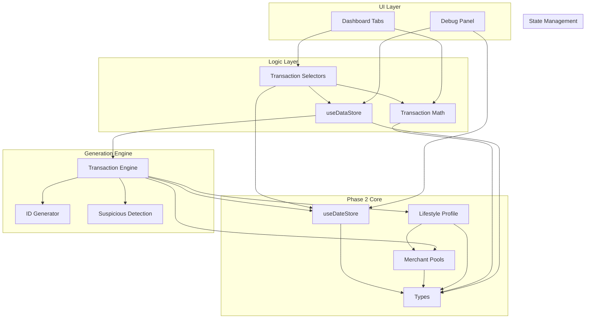

# Phase 2 Pre-Implementation Research Output

## 1. Repository Reconstruction Summary

The current `moneymap-v2` repository operates on a "v1" logic that is fundamentally incompatible with the Phase 2 architecture.

*   **Date System**: Currently split between `useUIStore` (view state) and `fakeData.ts` (generation state), with no synchronization. `isDateInRange` in `utils.ts` relies on string parsing, whereas Phase 2 requires strict `Date` object handling.
*   **Data Generation**: `fakeData.ts` is a monolithic file mixing merchant definitions, random generation, and basic categorization. It lacks the concept of a stable `LifestyleProfile` or incremental generation (Extend Mode).
*   **State Management**: `useDataStore.ts` persists all transactions, which is inefficient. It wipes data on "Reload", missing the "Extend" requirement.
*   **Math Logic**: Scattered across components (e.g., `Overview.tsx`) and `fakeData.ts` helpers (`getSpendingByCategory`). This leads to inconsistent totals and inability to handle transfer netting centrally.
*   **Categorization**: `categoryRules.ts` provides a solid foundation of regex patterns and category definitions, which can be preserved and extended.

## 2. Architectural Dependency Graph

## 3. Missing or Ambiguous Contracts

1.  **`fakeData.ts` exports**: Components currently import `getTotalIncome`, `getTotalSpending`, etc., directly from `fakeData.ts`. These must be replaced by `transactionMath.ts` functions, but the signatures might differ (e.g., `fakeData` versions might not take a filtered list).
2.  **`isDateInRange`**: The current utility expects strings (`YYYY-MM-DD`). Phase 2 stores use `Date` objects. We need to either update this utility or replace usage with a selector-based approach.
3.  **Category Rules**: `categoryRules.ts` is robust but needs to be integrated with the new `MerchantMeta` structure in Step 3. We need to ensure the regex patterns in `categoryRules` are accessible to the Transaction Engine.

## 4. Risk Analysis

| Area | Risk Level | Description | Mitigation |
|------|------------|-------------|------------|
| **Data Migration** | **High** | Replacing `fakeData.ts` breaks `useDataStore` and all tabs relying on its exports. | Create new modules first, then switch `useDataStore` to use them, then update tabs. |
| **Math Consistency** | **Medium** | New math layer excludes transfers. Existing UI might look "wrong" (lower totals) compared to old logic. | Explicitly communicate "Net" vs "Gross" changes. Verify transfer exclusion logic with unit tests. |
| **Date Synchronization** | **Medium** | Decoupling View Range from Dataset Range might confuse the UI if not clamped correctly. | Implement strict clamping logic in `useDateStore` actions. |
| **Performance** | **Low** | Selectors might re-compute too often if not memoized. | Use `useMemo` in components and proper Zustand selector patterns. |

## 5. Full Implementation Blueprint

### Phase 2.1: Foundation (Stores & Types)
1.  **Define Types**: Update `types/index.ts` with `GlobalDateState`, `LifestyleProfile`, `Transaction` (extended fields).
2.  **Create `useDateStore`**: Implement the global date state, actions (`setDatasetRange`, `setViewRange`), and persistence.
3.  **Create `merchantPools.ts`**: Extract and expand merchant data from `fakeData.ts` into structured pools.

### Phase 2.2: Core Logic (Math & Selectors)
1.  **Create `transactionMath.ts`**: Implement pure math functions (`getNetIncome`, `getTotalSpending`, `pairInternalTransfers`).
2.  **Create `transactionSelectors.ts`**: Implement selectors (`getTransactionsInViewRange`, `getCategoryTotals`) using `useDateStore` and `transactionMath`.

### Phase 2.3: Engine Construction
1.  **Create `idGenerator.ts`**: Implement deterministic ID logic (Step 4).
2.  **Create `suspiciousDetection.ts`**: Implement detection algorithms (Step 7).
3.  **Create `lifestyleProfile.ts`**: Implement profile generation logic (Step 2).
4.  **Create `transactionEngine.ts`**: Implement the 12-stage pipeline (Step 3).

### Phase 2.4: Integration & State Update
1.  **Update `useDataStore`**:
    *   Remove `loadDemoData` legacy logic.
    *   Add `generateData` action that calls `TransactionEngine`.
    *   Integrate `useDateStore` for range parameters.
2.  **Update `DebugPanel`**: Connect to new `useDateStore` actions (Extend vs Regenerate).

### Phase 2.5: UI Migration (Tab by Tab)
1.  **Overview Tab**: Replace inline filters with `transactionSelectors`.
2.  **Cashflow Tab**: Update to use `getDailyCashflowBuckets`.
3.  **Recurring/Fees/Review**: Update to use respective selectors and suspicious detection fields.
4.  **Cleanup**: Delete `fakeData.ts` and unused utils.

## 6. Questions for the User

1.  **Persistence Strategy**: The architecture implies persisting `datasetStart`/`End` and `profileId`. Should we also persist the *generated transactions* to localStorage to avoid re-generation on reload, or strictly re-generate from the seed (`profileId`)? (Legacy code persisted transactions).
    *   *Recommendation*: Persist `LifestyleProfile` and `DateState`. Re-generate transactions on load from these seeds to keep localStorage light, UNLESS user edits are allowed (Step 5.7 implies editing). If editing is allowed, we MUST persist transactions.
    *   *Assumption*: We will persist transactions for now to support future editing features.

2.  **Category Rules**: Should `categoryRules.ts` be the single source of truth for categories, or should the new `MerchantPools` define their own categories?
    *   *Recommendation*: Keep `categoryRules.ts` as the master list of categories and regex patterns, but let `MerchantPools` assign specific categories to specific merchants.

3.  **Date String vs Object**: The UI currently relies heavily on date strings (`YYYY-MM-DD`). Should we refactor the entire UI to use `Date` objects, or keep the conversion at the selector boundary?
    *   *Recommendation*: Keep conversion at the selector boundary for now to minimize UI churn, but return `Date` objects from the Engine/Store.

## 7. Next Step
Proceed to **Phase 2.1: Foundation**.
